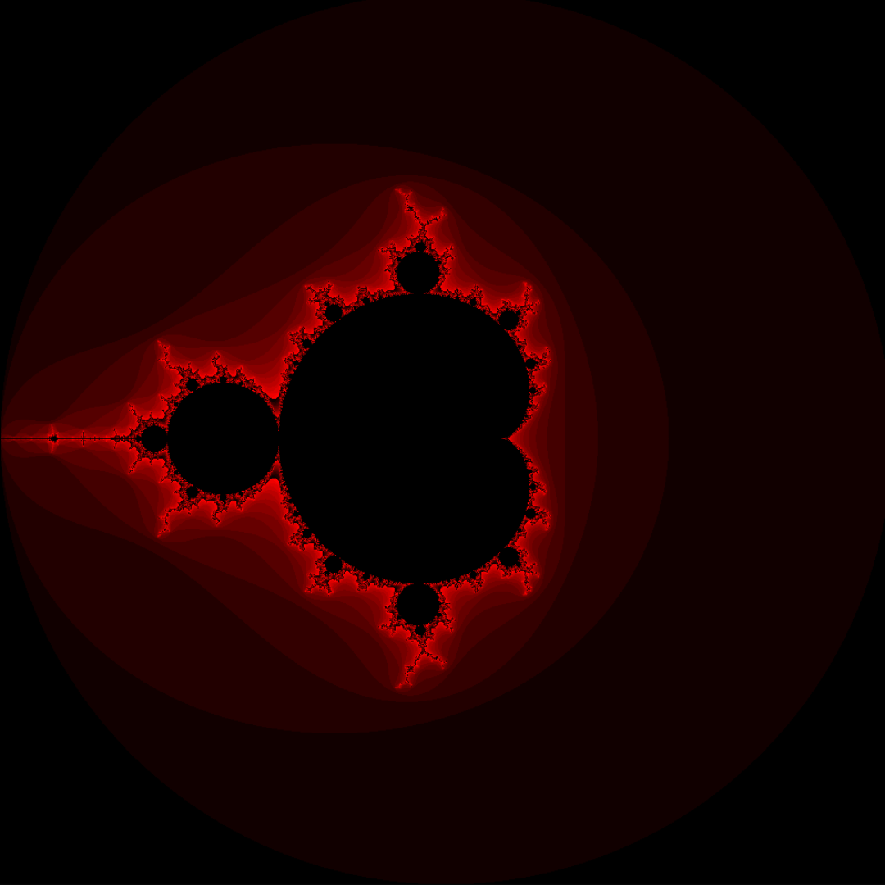
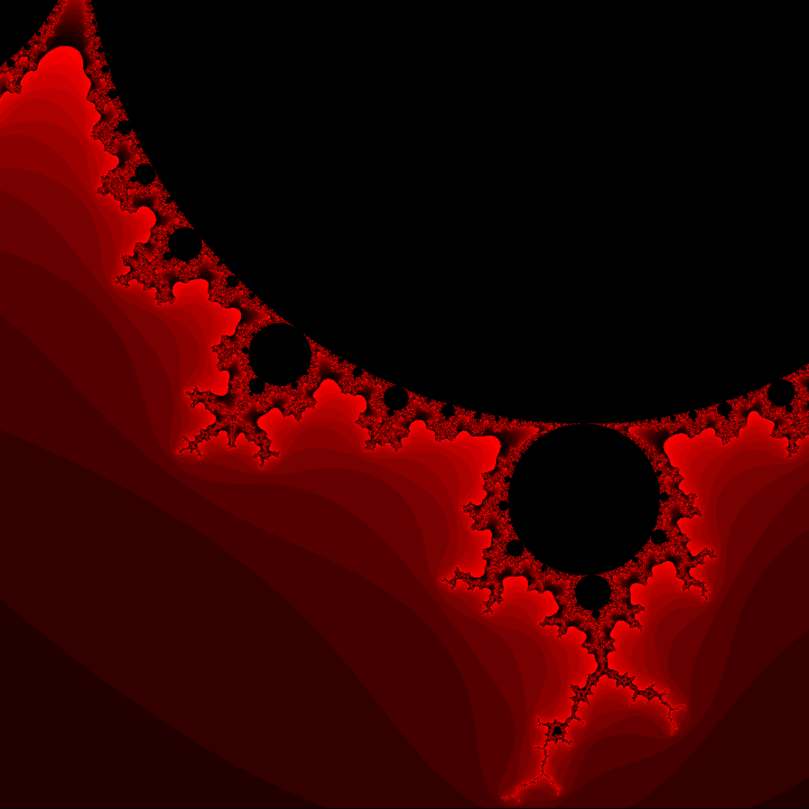
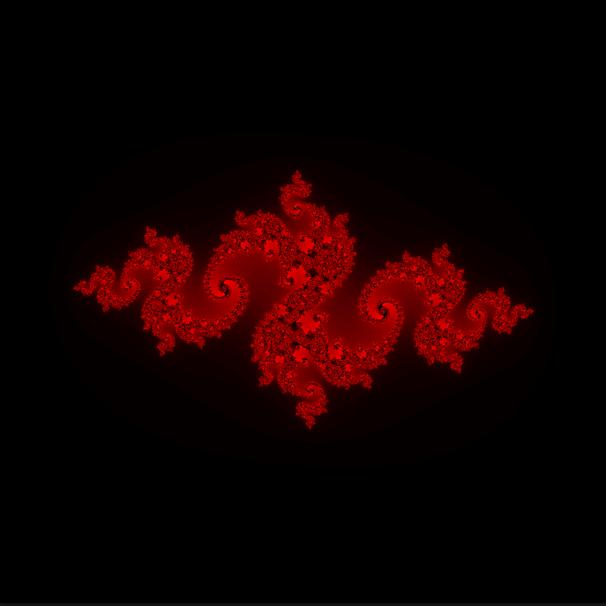
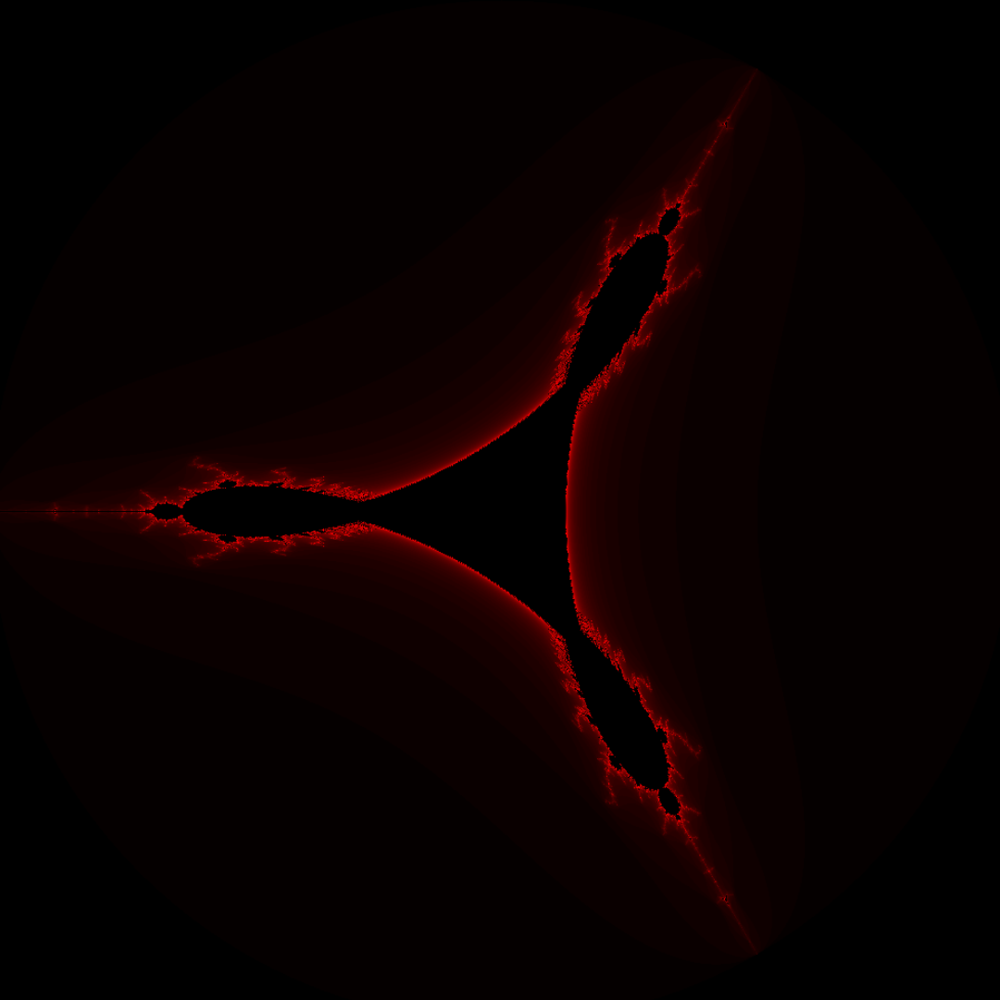

# FRACTAL YOUR WAY TO SEE INFINITY

## Building Fractol Project:
Run the following command:<br>
```$> make all```<br>
### <strong><span style="background-color: red">NOTE: Minilibx Lib should be in your current working directory.</span><strong>

## Running Program:
```$> cc ./fractol Set_name```<br>
<em style="font-size: 20px">For instance</em>:
- Mandlebrot Set:<br>
```$> ./fractol Mandlebrot```
- Julia Set:<br>
```$> ./fractol Julia <Real Part> <Imaginary Part>```<br>
- Tricorn Set:<br>
```$> ./fractol Tricorn```<br>
### <strong><span style="background-color: red">In case of error, a list of available sets will be displayed</span><strong>

## Project Aim:
<p>The Fractol project opens the door to explore fascinating mathematical visualizations. Dive into the world of fractals and expand your mind.</p>

## Project Visualization:
### Mandelbrot Fractal >>
 

### Julia Fractal >> Z = -0.79 + 0.15i | Z = 0.28 + 0.008i



### Tricorn Fractal >>

